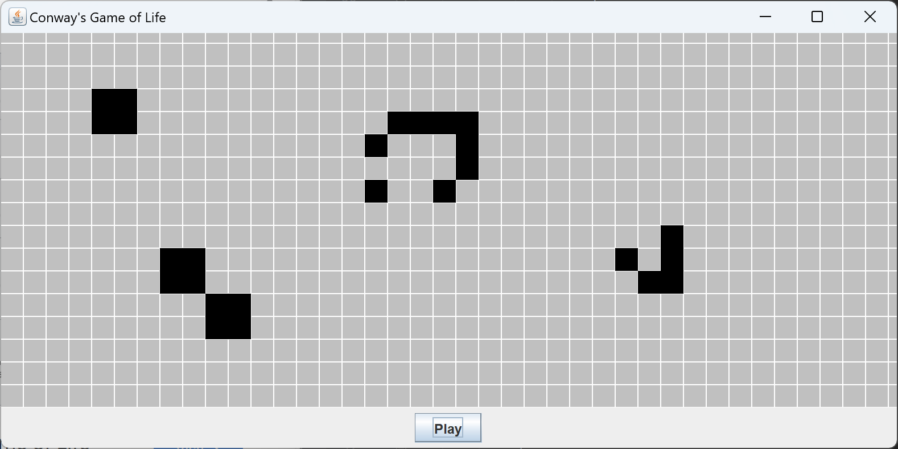
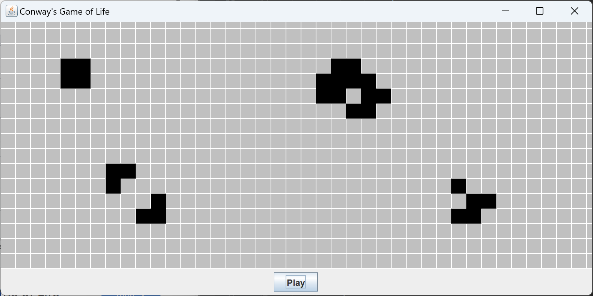

# Conway's Game of Life

The Game of Life, also known simply as Conway's Game of Life or simply Life, 
is a cellular automaton devised by the British mathematician John Horton Conway in 1970.
It is a zero-player game, meaning that its evolution is determined by its initial state, requiring no further input.
[wiki](https://en.wikipedia.org/wiki/Conway%27s_Game_of_Life)

### Links
[Conway's Game of Life](https://playgameoflife.com/)